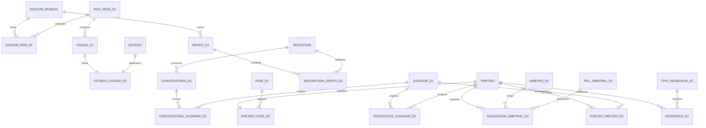

# Documento técnico — Entrega 2

## Sistema ampliado de información para la Copa Mundial de la FIFA

**Curso:** Bases de Datos  
**Motor:** Oracle Database  
**Entrega:** 2 — ampliación del modelo, consultas, roles y pruebas (VERSIÓN BÁSICA)

> **Nota de alcance básico:** igual que la Entrega 1, solo usa Modelo Relacional,
> SQL, JOINS, Agregación/Subconsultas, Vistas, Modificadores e
> Integridad/Privilegios. Sin PLSQL/Triggers, secuencias, `TIMESTAMP`,
> FK compuestas, `WITH`, ventanas ni PL/SQL. La auditoría es manual
> (INSERT explícito + verificación con `LEFT JOIN`).

## 1. Objetivo y alcance  
**Responsable:** Andrés Gómez

## 1. Objetivo y alcance

La Entrega 2 amplía el modelo inicial de la Entrega 1 sin romper sus cinco tablas
base: `EDICION_MUNDIAL`, `ESTADIO`, `SELECCION`, `PARTIDO` y
`PARTICIPACION_PARTIDO`.

La ampliación incorpora:

- Sedes normalizadas mediante países y ciudades.
- Catálogo de fases y relación fase-partido.
- Grupos e inscripción de selecciones.
- Jugadores, posiciones, convocatorias y dorsales.
- Estadísticas de jugador por partido.
- Árbitros, roles arbitrales y asignaciones.
- Eventos del partido.
- Incidencias operativas.
- Auditoría MANUAL de incidencias (tabla + INSERT explícito, sin trigger).
- Tres perfiles de acceso: administrador, analista y auditor.

El diseño conserva las columnas textuales `pais_sede` y `fase` de la Entrega 1 para
mantener compatibilidad con los scripts anteriores. En la Entrega 2 las relaciones
normalizadas `EDICION_PAIS_E2`, `CIUDAD_E2` y `FASE_E2` son las fuentes utilizadas
por las consultas ampliadas.

## 2. Modelo entidad–relación ampliado

## 3. Transformación lógica y normalización

### 3.1 Relaciones principales

- `PAIS_SEDE_E2(id_pais_sede PK, nombre UK, codigo_iso UK)`
- `EDICION_PAIS_E2(id_edicion PK/FK, id_pais_sede PK/FK, tipo_sede)`
- `CIUDAD_E2(id_ciudad PK, id_pais_sede FK, nombre, UK(id_pais_sede,nombre))`
- `ESTADIO_CIUDAD_E2(id_estadio PK/FK, id_ciudad FK)`
- `FASE_E2(id_fase PK, codigo UK, orden_fase UK, tipo_fase)`
- `PARTIDO_FASE_E2(id_partido PK/FK, id_edicion, id_fase FK)`
- `GRUPO_E2(id_grupo PK, id_edicion FK, codigo, UK(id_edicion,codigo))`
- `INSCRIPCION_GRUPO_E2(id_grupo PK/FK, id_seleccion PK/FK, orden_inicial, es_cabeza_serie)`
- `JUGADOR_E2(id_jugador PK, nombres, apellidos, fecha_nacimiento, id_posicion FK, pie_dominante)`
- `CONVOCATORIA_E2(id_convocatoria PK, id_edicion, id_seleccion, fecha_corte, estado)`
- `CONVOCATORIA_JUGADOR_E2(id_convocatoria PK/FK, id_jugador PK/FK, dorsal, es_capitan)`
- `ESTADISTICA_JUGADOR_E2(id_partido PK/FK, id_jugador PK/FK, id_convocatoria FK, indicadores)`
- `ARBITRO_E2(id_arbitro PK, nombres, apellidos, confederacion, activo)`
- `ASIGNACION_ARBITRAL_E2(id_partido PK/FK, id_arbitro PK/FK, id_rol PK/FK, calificacion)`
- `EVENTO_PARTIDO_E2(id_evento PK, id_partido FK, id_tipo_evento FK, id_jugador FK, minuto, descripcion)`
- `INCIDENCIA_E2(id_incidencia PK, id_partido FK, id_tipo_incidencia FK, minuto, descripcion, resuelta)`
- `AUDITORIA_E2(id_auditoria PK, tabla_afectada, operacion, id_registro, usuario_bd, fecha_evento)`

### 3.2 Dependencias funcionales

- `id_pais_sede → nombre, codigo_iso`.
- `(id_edicion, id_pais_sede) → tipo_sede`.
- `(id_pais_sede, nombre) → id_ciudad`.
- `id_fase → codigo, orden_fase, tipo_fase`.
- `(id_edicion, codigo_grupo) → nombre`.
- `(id_convocatoria, id_jugador) → dorsal, es_capitan`.
- `(id_partido, id_jugador) → todas las métricas de la estadística`.
- `(id_partido, id_arbitro, id_rol) → calificacion`.
- `id_tipo_evento → nombre, afecta_marcador`.
- `id_tipo_incidencia → nombre, severidad`.

Los atributos descriptivos se mantienen en su entidad propietaria. Por ejemplo, el
nombre de la posición está en `POSICION_JUGADOR_E2`, no repetido en cada jugador; la
severidad está en `TIPO_INCIDENCIA_E2`, no repetida en cada incidencia; y las métricas
del jugador dependen de la combinación partido-jugador. Esto evita dependencias
parciales y transitivas en las nuevas relaciones y mantiene el modelo ampliado en 3FN.

## 4. Datos ampliados (solo INSERT básicos)

`sql/09_datos_entrega2.sql` usa solo `INSERT INTO ... VALUES` sobre la base
básica de la Entrega 1 (2 ediciones, 8 partidos, 10 selecciones):

- 5 países y 5 relaciones edición-país.
- 5 ciudades y 5 uniones estadio-ciudad.
- 4 fases y 8 relaciones partido-fase.
- 4 grupos y 10 inscripciones.
- 10 convocatorias, 20 jugadores y 20 convocatoria-jugador.
- 4 árbitros, 2 roles y 8 asignaciones (una central por partido).
- 3 tipos de evento, 12 eventos y 12 estadísticas coherentes.
- 3 tipos de incidencia, 4 incidencias y 4 filas de auditoría manual.

Los datos siguen siendo sintéticos y no representan personas reales.

## 5. Consultas (versión básica, sin WITH ni ventanas)

`sql/11_consultas_entrega2.sql` contiene ocho consultas solo con
`JOIN`, `GROUP BY/HAVING`, `ORDER BY`, agregados y subconsultas:

1. Top 5 goleadores 2026 (`ORDER BY + FETCH FIRST`).
2. Mayor asistencia por fase (`MAX` correlacionado).
3. Rendimiento por grupo (vista + `ORDER BY`).
4. Ediciones sobre el promedio (`AVG` + `HAVING`).
5. Jugadores con tarjetas + conteo de eventos (subconsulta escalar).
6. Carga de árbitros centrales (`HAVING >= 2`, dataset pequeño).
7. Fases con más incidencias que el promedio (conteo vs `AVG` de conteos).
8. Goleadores en más de una fase (`HAVING COUNT(DISTINCT fase) > 1`).

## 6. Roles y privilegios

`sql/12_roles_entrega2.sql` define:

### Administrador del Torneo

`ROL_FIFA_E2_ADMIN_TORNEO` puede consultar y modificar las tablas operativas de las
dos entregas. Puede leer la auditoría, pero no modificarla directamente.

### Analista Deportivo

`ROL_FIFA_E2_ANALISTA_DEP` solo consulta vistas de rendimiento, grupos, ediciones,
arbitraje, fases y marcador. No recibe `INSERT`, `UPDATE` ni `DELETE`.

### Auditor/Consulta

`ROL_FIFA_E2_AUDITOR_CONSULTA` solo consulta indicadores operativos y
`VW_E2_AUDITORIA_CONSULTA`. No tiene acceso directo a las tablas operativas ni
permisos DML.

La creación de roles y las pruebas con usuarios reales requieren permisos DBA del
servidor del curso.

## 7. Pruebas (solo DML + SELECT)

`sql/13_pruebas_entrega2.sql` contiene, sin PL/SQL:

- Un caso exitoso de incidencia + auditoría manual.
- Un caso exitoso de conteo de grupos/inscripciones.
- 4 casos fallidos comentados (dorsal duplicado, minutos negativos,
  fase sin partido, evento fuera de rango) con el ORA esperado.
- Limpieza con `DELETE` de la fila temporal.

`sql/14_verificacion_entrega2.sql` comprueba conteos y 4 reglas con
cero filas (dorsales, estadísticas huérfanas, partidos sin fase,
incidencias sin auditoría), más el conteo de las 6 vistas.

## 8. Orden de ejecución

1. Scripts 01–07 de la Entrega 1.
2. `sql/08_ddl_entrega2.sql`.
3. `sql/09_datos_entrega2.sql`.
4. `sql/10_vistas_entrega2.sql`.
5. `sql/11_consultas_entrega2.sql`.
6. `sql/12_roles_entrega2.sql`, con permisos DBA.
7. `sql/13_pruebas_entrega2.sql`.
8. `sql/14_verificacion_entrega2.sql`.

Todos los scripts con INSERT/SELECT se ejecutan en SQL Developer con
**Run Script (F5)**. No hay bloques PL/SQL.

## 9. Evidencias pendientes

Antes de entregar se deben guardar:

- Salida de `14_verificacion_entrega2.sql`.
- Resultados de las ocho consultas avanzadas.
- Salida de los casos exitosos y fallidos.
- Evidencia de permisos para cada rol en sesiones separadas.
- Diagrama ERD exportado.
- Historial de la rama `feature/entrega-2`, commit y pull request.
