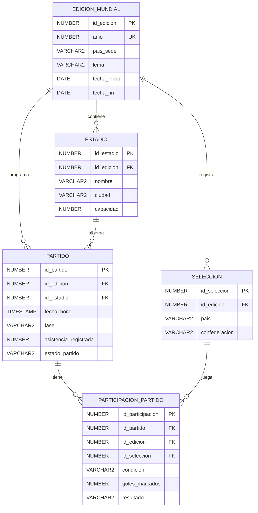
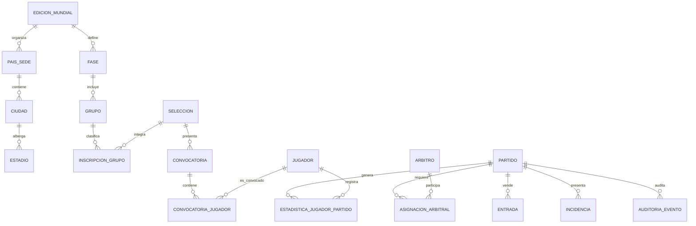

# Documento técnico — Entrega 1

## Sistema de Información para la Gestión Integral de la Copa Mundial de la FIFA

**Curso:** Bases de Datos  
**Motor:** Oracle Database  
**Cliente:** Oracle SQL Developer  
**Integrante:** Andrés Gómez  
**Entrega:** 1 — Modelo relacional, SQL e integridad sobre el modelo inicial

## 1. Descripción del problema y alcance

Una Copa Mundial genera información relacionada con sus ediciones, sedes, estadios,
selecciones y partidos. Para esta primera entrega se construye una base relacional que
permite registrar el calendario de un partido, asociarlo con un estadio y una edición,
relacionar exactamente dos selecciones con el encuentro y consultar el marcador resultante.

El alcance implementado corresponde al modelo genérico inicial de cinco entidades:

- `EDICION_MUNDIAL`: identifica una edición, su sede declarada, lema y fechas.
- `ESTADIO`: registra los escenarios disponibles para una edición.
- `SELECCION`: registra las selecciones participantes y su confederación.
- `PARTIDO`: registra fase, fecha, estadio, asistencia y estado del encuentro.
- `PARTICIPACION_PARTIDO`: resuelve la relación muchos-a-muchos entre partidos y
  selecciones, indicando condición y goles.

El sistema de esta entrega soporta:

1. Integridad referencial entre edición, estadio, selección y partido.
2. Validación del rango de fechas y de la agenda de los estadios.
3. Control de una selección local y una visitante por partido.
4. Coherencia entre goles y resultado de cada participación.
5. Carga de datos sintéticos, vistas analíticas y quince consultas SQL.
6. Pruebas de operaciones DML inválidas y de comportamientos de borrado.
7. Separación básica de permisos de consulta y operación.

No se implementan todavía jugadores, convocatorias, cuerpo técnico, arbitraje,
estadísticas detalladas, grupos, boletería, medios, incidencias ni auditoría. Estos
componentes se anticipan en la evaluación crítica y se desarrollarán después de recibir
retroalimentación sobre esta entrega.

### Interpretación del alcance

El enunciado presenta un mínimo general de 12–16 tablas para el proyecto completo, pero
indica expresamente que la Entrega 1 debe desarrollarse únicamente sobre el modelo
genérico inicial de cinco entidades. Por ello, esta versión implementa las cinco tablas y
deja la ampliación para las entregas 2 y 3. La tabla `PARTIDO` y la tabla
`PARTICIPACION_PARTIDO` reciben ajustes menores, documentados a continuación, para poder
cumplir las consultas y reglas de integridad exigidas en la Entrega 1.

## 2. Supuestos de modelado

1. **Identificadores:** las claves primarias son numéricas y no se reutilizan. En el
   dataset se cargan explícitamente para que las relaciones puedan auditarse fácilmente.
2. **Edición:** `anio` identifica de forma única una edición en el alcance de esta
   entrega. `pais_sede` conserva el atributo textual del modelo inicial; la separación de
   varios países anfitriones se propone como mejora futura.
3. **Fechas:** `fecha_inicio` y `fecha_fin` delimitan el periodo operativo de una edición.
   Un partido debe ocurrir entre el inicio y el final inclusive.
4. **Estadio:** un estadio pertenece a una sola edición en esta versión. La clave
   compuesta `(id_estadio, id_edicion)` se utiliza para evitar que un partido mezcle un
   estadio de otra edición.
5. **Selección:** una selección se registra como participante de una edición concreta.
   La misma denominación puede reaparecer en otra edición como un registro diferente.
6. **Partido:** cada partido tiene un único estadio, fecha/hora, fase y estado. Se evita
   la doble reserva de un estadio mediante una restricción `UNIQUE`.
7. **Participación:** cada partido cerrado tiene exactamente dos participaciones: una
   `LOCAL` y una `VISITANTE`. La unicidad de selección y condición evita duplicados.
8. **Marcador:** `goles_marcados` nunca es negativo. `resultado` se valida contra los
   goles de la otra participación del mismo partido.
9. **Estado transitorio:** un partido se puede crear como `PROGRAMADO` antes de cargar sus
   participaciones. Solo se puede pasar a `FINALIZADO` cuando tiene exactamente dos
   participaciones coherentes.
10. **Asistencia:** se registra por partido, aunque el modelo inicial no la incluía,
    porque la consulta de ocupación la exige. El trigger compara la asistencia con la
    capacidad del estadio.
11. **Datos:** todos los nombres de personas o resultados son ficticios. No se almacenan
    datos personales sensibles reales.
12. **Calendario sintético:** las fechas se generan en orden de fase para que la evolución
    deportiva sea cronológicamente legible. Las selecciones sintéticas 01 y 02 se
    conservan como casos de prueba que solo aparecen como visitantes.
13. **Oracle:** Oracle no soporta `ON UPDATE CASCADE` en claves foráneas. Las relaciones
    usan `ON DELETE CASCADE` únicamente donde la existencia del hijo depende totalmente
    del partido; en las demás se conserva el comportamiento `NO ACTION` implícito. Las
    claves no se actualizan como parte de la operación normal.

## 3. Modelo entidad–relación

El siguiente ERD representa el modelo implementado. La cardinalidad de
`PARTICIPACION_PARTIDO` se lee como una relación de uno a muchos durante la carga, con la
regla adicional de exactamente dos filas al cerrar el partido.



## 4. Transformación al modelo lógico relacional

### 4.1 Relaciones resultantes

```text
EDICION_MUNDIAL(
  id_edicion PK,
  anio UK,
  pais_sede,
  lema,
  fecha_inicio,
  fecha_fin
)

ESTADIO(
  id_estadio PK,
  id_edicion FK -> EDICION_MUNDIAL.id_edicion,
  nombre,
  ciudad,
  capacidad,
  UK(id_edicion, nombre)
)

SELECCION(
  id_seleccion PK,
  id_edicion FK -> EDICION_MUNDIAL.id_edicion,
  pais,
  confederacion,
  UK(id_edicion, pais)
)

PARTIDO(
  id_partido PK,
  id_edicion FK -> EDICION_MUNDIAL.id_edicion,
  id_estadio,
  fecha_hora,
  fase,
  asistencia_registrada,
  estado_partido,
  FK(id_estadio, id_edicion) -> ESTADIO(id_estadio, id_edicion),
  UK(id_estadio, fecha_hora)
)

PARTICIPACION_PARTIDO(
  id_participacion PK,
  id_partido,
  id_edicion,
  id_seleccion,
  condicion,
  goles_marcados,
  resultado,
  FK(id_partido, id_edicion) -> PARTIDO(id_partido, id_edicion),
  FK(id_seleccion, id_edicion) -> SELECCION(id_seleccion, id_edicion),
  UK(id_partido, id_seleccion),
  UK(id_partido, condicion)
)
```

### 4.2 Justificación de llaves y cardinalidades

- `EDICION_MUNDIAL` es la entidad raíz del dominio. Su PK permite que una edición
  tenga múltiples estadios, selecciones y partidos.
- `ESTADIO.id_edicion` y `SELECCION.id_edicion` son FKs obligatorias: no existe un
  estadio ni una selección en el sistema sin una edición asociada.
- `PARTIDO.id_edicion` permite consultar y validar el calendario de una edición. La FK
  compuesta contra `ESTADIO` asegura que el estadio pertenece a esa misma edición.
- `PARTICIPACION_PARTIDO` es la entidad asociativa de la relación N:M entre partidos y
  selecciones. Una selección participa en muchos partidos y un partido tiene dos
  selecciones.
- `UK(id_partido, id_seleccion)` impide que una selección aparezca dos veces en el mismo
  encuentro.
- `UK(id_partido, condicion)` impide dos locales o dos visitantes.
- La cantidad máxima de dos participaciones se controla con un trigger de sentencia. La
  cantidad exacta se valida al cambiar el partido a `FINALIZADO`.
- Las claves compuestas no duplican la identidad del registro; refuerzan la consistencia
  entre entidades que comparten la edición.

### 4.3 Decisiones de borrado y actualización

| Relación | Borrado | Actualización | Justificación |
|---|---|---|---|
| Edición → Estadio | `NO ACTION` implícito | No disponible en Oracle | No se puede borrar una edición con estadios dependientes. |
| Edición → Selección | `NO ACTION` implícito | No disponible en Oracle | Conserva el historial de participantes. |
| Edición → Partido | `NO ACTION` implícito | No disponible en Oracle | Impide eliminar el calendario accidentalmente. |
| Estadio → Partido | `NO ACTION` implícito | No disponible en Oracle | Evita dejar partidos sin sede. |
| Partido → Participación | `CASCADE` | No disponible en Oracle | Una participación no tiene sentido sin su partido; al borrar el partido se limpian sus dos filas. |
| Selección → Participación | `NO ACTION` implícito | No disponible en Oracle | Una selección con partidos no puede eliminarse y perder el historial. |

En Oracle el comportamiento `NO ACTION` es el comportamiento por defecto cuando no se
especifica `ON DELETE CASCADE`; la operación se rechaza si existen filas hijas. Oracle no
permite escribir `ON UPDATE CASCADE` en una FK, por lo que no se incluye una sintaxis
incompatible. La prueba DML documenta ambas decisiones.

## 5. Diccionario de datos

### 5.1 `EDICION_MUNDIAL`

| Atributo | Tipo | Nulo | Restricciones | Descripción |
|---|---|---|---|---|
| `id_edicion` | `NUMBER(4)` | No | PK | Identificador interno de la edición. |
| `anio` | `NUMBER(4)` | No | `UNIQUE`, `CHECK` entre 1930 y 2200 | Año de la edición. |
| `pais_sede` | `VARCHAR2(120)` | No | — | País o conjunto de países sede en el alcance inicial. |
| `lema` | `VARCHAR2(200)` | No | — | Lema o nombre descriptivo de la edición. |
| `fecha_inicio` | `DATE` | No | Junto con `fecha_fin` | Inicio del periodo del torneo. |
| `fecha_fin` | `DATE` | No | Mayor que `fecha_inicio` | Fin del periodo del torneo. |

### 5.2 `ESTADIO`

| Atributo | Tipo | Nulo | Restricciones | Descripción |
|---|---|---|---|---|
| `id_estadio` | `NUMBER(10)` | No | PK | Identificador del estadio. |
| `id_edicion` | `NUMBER(4)` | No | FK a `EDICION_MUNDIAL` | Edición a la que se asigna el estadio. |
| `nombre` | `VARCHAR2(120)` | No | Único por edición | Nombre del estadio. |
| `ciudad` | `VARCHAR2(80)` | No | — | Ciudad sede. |
| `capacidad` | `NUMBER(6)` | No | `CHECK` entre 10.000 y 120.000 | Aforo máximo del estadio. |

### 5.3 `SELECCION`

| Atributo | Tipo | Nulo | Restricciones | Descripción |
|---|---|---|---|---|
| `id_seleccion` | `NUMBER(10)` | No | PK | Identificador de la selección dentro del esquema. |
| `id_edicion` | `NUMBER(4)` | No | FK a `EDICION_MUNDIAL` | Edición en la que participa. |
| `pais` | `VARCHAR2(100)` | No | Único por edición | Nombre de la selección; en el dataset es sintético. |
| `confederacion` | `VARCHAR2(20)` | No | `CHECK` de confederaciones FIFA | Confederación continental declarada. |

### 5.4 `PARTIDO`

| Atributo | Tipo | Nulo | Restricciones | Descripción |
|---|---|---|---|---|
| `id_partido` | `NUMBER(10)` | No | PK | Identificador del encuentro. |
| `id_edicion` | `NUMBER(4)` | No | FK a `EDICION_MUNDIAL` | Edición del encuentro. |
| `id_estadio` | `NUMBER(10)` | No | FK compuesta con `id_edicion` | Estadio donde se juega. |
| `fecha_hora` | `TIMESTAMP` | No | Única por estadio; dentro de la edición | Fecha y hora programadas. |
| `fase` | `VARCHAR2(30)` | No | `CHECK` de fases permitidas | Fase o instancia del torneo. |
| `asistencia_registrada` | `NUMBER(6)` | No | No negativa y menor o igual a capacidad | Público registrado para el encuentro. |
| `estado_partido` | `VARCHAR2(15)` | No | `CHECK`: programado, en juego, finalizado o cancelado | Estado operativo del partido. |

### 5.5 `PARTICIPACION_PARTIDO`

| Atributo | Tipo | Nulo | Restricciones | Descripción |
|---|---|---|---|---|
| `id_participacion` | `NUMBER(12)` | No | PK | Identificador de la participación. |
| `id_partido` | `NUMBER(10)` | No | FK compuesta; `ON DELETE CASCADE` | Encuentro al que pertenece. |
| `id_edicion` | `NUMBER(4)` | No | Parte de las FKs compuestas | Edición redundante para reforzar coherencia. |
| `id_seleccion` | `NUMBER(10)` | No | FK compuesta | Selección que participa. |
| `condicion` | `VARCHAR2(10)` | No | `CHECK`: `LOCAL` o `VISITANTE`; única por partido | Rol de la selección en el encuentro. |
| `goles_marcados` | `NUMBER(3)` | No | `CHECK` entre 0 y 99 | Goles anotados por la selección. |
| `resultado` | `VARCHAR2(7)` | No | `CHECK`: `GANO`, `EMPATO` o `PERDIO` | Resultado de la selección frente al marcador rival. |

## 6. Implementación DDL y restricciones de negocio

El archivo `sql/01_ddl.sql` implementa:

- Las cinco tablas y sus PK.
- FKs obligatorias, incluyendo FKs compuestas para mantener la edición coherente.
- `UNIQUE` para años, nombres de estadio por edición, selecciones por edición, agenda
  del estadio, selección por partido y condición por partido.
- `CHECK` para rangos, estados, fases, confederaciones, condiciones, goles y resultados.
- Trigger de validación de fecha del partido y capacidad del estadio.
- La combinación de `CHECK` de condición y `UNIQUE(id_partido, condicion)` limita el
  partido a una participación local y una visitante.
- Trigger de coherencia entre goles y resultado.
- Trigger de cierre: un partido solo puede quedar `FINALIZADO` con exactamente dos
  participaciones.
- Contexto de borrado para permitir `ON DELETE CASCADE` sin permitir que un
  `FINALIZADO` quede incompleto por un `DELETE` directo de su participación.
- Protección de fechas de ediciones y capacidades de estadios cuando ya existen partidos
  dependientes.
- Índices sobre fase/edición, selección y agenda.

### 6.1 Restricciones derivadas del dominio

| Regla | Implementación | Razón |
|---|---|---|
| No hay goles negativos | `CHECK` en `goles_marcados` | Un marcador no puede ser negativo. |
| Un partido tiene un local y un visitante | `UNIQUE(id_partido, condicion)` y trigger de cierre | Evita duplicados y valida la pareja completa. |
| No hay tercera selección | `CHECK` de condición, `UNIQUE(id_partido, condicion)` y trigger de cierre | La relación deportiva es binaria en esta entrega. |
| Un partido debe usar un estadio de su edición | FK compuesta | Evita cruces de edición. |
| El partido ocurre durante el torneo | Trigger contra fechas de la edición | Impide calendarios fuera de rango. |
| Un estadio no tiene horarios cruzados | `UNIQUE(id_estadio, fecha_hora)` | Evita doble reserva. |
| Asistencia no supera aforo | Trigger contra `ESTADIO.capacidad` | Preserva coherencia operativa. |
| El resultado corresponde a los goles | Trigger compuesto | Evita que el texto contradiga el marcador. |
| No se elimina una selección con historial | FK con `NO ACTION` implícito | Preserva trazabilidad deportiva. |
| Un partido finalizado está completo | Trigger sobre `PARTIDO` | Cierra el flujo solo con dos participantes. |

Las reglas de convocatorias, edad, dorsales, jugadores, árbitros y estadísticas
individuales se declaran fuera de alcance porque esas entidades no existen en el modelo
inicial. Se incorporan como trabajo de la Entrega 2.

## 7. Datos de prueba

El archivo `sql/02_datos_prueba.sql` carga un dataset sintético reproducible mediante
PL/SQL:

- 4 ediciones (`2026`, `2030`, `2034` y `2038`).
- 100 estadios, 25 por edición.
- 192 selecciones, 48 por edición.
- 416 partidos, 104 por edición.
- 832 participaciones, exactamente dos por partido.

La tabla de ediciones es un catálogo pequeño y por naturaleza no requiere 100 filas. Las
demás tablas de operación superan el mínimo de 100 registros solicitado. Todos los
encuentros tienen fechas dentro de su edición, siguen el orden de sus fases, usan un
estadio de la misma edición y tienen dos selecciones distintas. Las selecciones
sintéticas 01 y 02 permiten obtener resultados para el caso “todos los partidos como
visitante” de la consulta 10.

## 8. Vistas

Se implementan cinco vistas en `sql/03_vistas.sql`:

1. **`VW_MARCADOR_PARTIDOS`**: muestra partido, fase, sede, local, visitante y marcador
   en una sola fila. Simplifica el calendario y se reutiliza en consultas de partidos
   atípicos y máximos marcadores; las consultas analíticas filtran partidos finalizados.
2. **`VW_TABLA_POSICIONES`**: calcula partidos, victorias, empates, derrotas, puntos,
   goles a favor, goles en contra y diferencia por edición y selección, únicamente a
   partir de partidos finalizados.
3. **`VW_GOLEADORES_SEL`**: consolida goles y partidos por selección y edición usando
   partidos finalizados. Sirve para rankings sobre el modelo inicial.
4. **`VW_OCUPACION_ESTADIO`**: calcula asistencia total, partidos albergados y ocupación
   promedio estimada por estadio.
5. **`VW_PARTIDOS_ATIPICOS`**: reutiliza el marcador para identificar partidos 0–0 o
   con ocho o más goles combinados. El umbral de ocho se declara como supuesto analítico.

Las vistas reducen lógica repetida, facilitan el acceso de consulta y permiten restringir
la exposición a columnas operativas innecesarias.

## 9. Modificadores DML y pruebas

El archivo `sql/04_dml_pruebas.sql`:

1. Crea un partido de prueba en estado `PROGRAMADO`.
2. Inserta sus dos participaciones con `INSERT ALL`.
3. Actualiza el marcador de ambas selecciones.
4. Cambia el encuentro a `FINALIZADO`.
5. Intenta un gol negativo, una tercera participación, una fecha fuera de rango, un
   resultado inconsistente, el borrado de una participación finalizada y el cierre
   directo de un partido sin participaciones.
6. Borra el partido de prueba y verifica que sus participaciones se borran por
   `ON DELETE CASCADE`.
7. Intenta eliminar una selección con historial y verifica el rechazo por `NO ACTION`.

Cada caso inválido captura `SQLERRM`, revierte la operación con un savepoint y deja el
resultado visible en `DBMS_OUTPUT`.

## 10. Privilegios básicos

El archivo `sql/05_privilegios.sql` debe ejecutarse por el administrador o por un usuario
con permisos de creación de roles:

- `ROL_FIFA_E1_ANDRES_CONSULTA`: `SELECT` sobre las cinco tablas y las cinco vistas; no recibe
  permisos de modificación.
- `ROL_FIFA_E1_ANDRES_OPERATIVO`: `SELECT` sobre el modelo y `INSERT`/`UPDATE` sobre `PARTIDO` y
  `PARTICIPACION_PARTIDO`; no recibe `DELETE` ni permisos sobre una tabla de auditoría.

El esquema inicial todavía no tiene auditoría. El control de auditoría se incorporará en
la ampliación del modelo. La prueba de acceso se debe completar otorgando los roles a
usuarios de prueba del servidor del curso y ejecutando una consulta permitida y una
operación denegada por cada rol.

## 11. Álgebra relacional

Las traducciones de cuatro consultas SQL se encuentran en
[`algebra_relacional.md`](algebra_relacional.md). Se utilizan selección `σ`, proyección
`π`, renombre `ρ`, junta `⋈`, agregación `γ`, diferencia `−` y ordenamiento extendido para
expresar rankings.

## 12. Evaluación crítica del modelo inicial

Esta sección es analítica y no modifica el DDL de la Entrega 1.

### 12.1 Problemas identificados y ajustes propuestos

| Problema del modelo inicial | Consecuencia | Ajuste propuesto para la ampliación | Beneficio |
|---|---|---|---|
| `pais_sede` es texto libre | No representa varios países y duplica información | Crear `PAIS_SEDE` y una relación entre edición y país sede | Normaliza anfitriones y permite agregaciones confiables. |
| `ciudad` está dentro de `ESTADIO` | Se repite el nombre de ciudad en varios estadios | Crear `CIUDAD` relacionada con sede | Evita inconsistencias de escritura. |
| `fase` es texto libre en `PARTIDO` | Puede haber valores incompatibles | Crear catálogo `FASE` y, si aplica, `LLAVE_ELIMINATORIA` | Controla fases y cruces. |
| No existe `GRUPO` | No se puede derivar tabla de posiciones por grupo | Crear `GRUPO` y `INSCRIPCION_GRUPO` por edición | Modela fase de grupos y clasificación. |
| No se modelan jugadores | No se pueden registrar convocatorias o rendimiento | Crear `JUGADOR`, `CONVOCATORIA` y `CONVOCATORIA_JUGADOR` | Permite historial por edición, dorsal y selección. |
| No se modela el cuerpo técnico | Falta información de responsables deportivos | Crear `CUERPO_TECNICO` y asignaciones | Representa entrenadores y asistentes. |
| No se modela arbitraje | No se conoce quién dirigió un partido | Crear `ARBITRO`, `ROL_ARBITRAL` y `ASIGNACION_ARBITRAL` | Resuelve la relación N:M con roles. |
| No hay eventos individuales | El marcador no puede auditarse por jugador | Crear `EVENTO_PARTIDO` y/o `ESTADISTICA_JUGADOR_PARTIDO` | Permite goles, asistencias, tarjetas y minutos. |
| No hay boletería ni público detallado | La asistencia no se puede explicar por entradas | Crear `ENTRADA`, `ZONA_ESTADIO` y control de acceso | Soporta ventas y ocupación real. |
| No hay medios ni acreditaciones | No se controla acceso de prensa | Crear `MEDIO`, `PERIODISTA` y `ACREDITACION` | Separa información pública y operativa. |
| No hay incidencias | No se registran suspensiones o eventos VAR | Crear `TIPO_INCIDENCIA` e `INCIDENCIA` | Permite análisis operativo por fase y sede. |
| No hay auditoría | No existe trazabilidad de cambios | Crear `AUDITORIA_EVENTO` y triggers | Registra actor, fecha y modificación. |

### 12.2 Boceto conceptual del modelo ampliado



### 12.3 Entidades anticipadas

`PAIS_SEDE`, `CIUDAD`, `FASE`, `GRUPO`, `LLAVE_ELIMINATORIA`,
`INSCRIPCION_GRUPO`, `FEDERACION_NACIONAL`, `JUGADOR`, `CONVOCATORIA`,
`CONVOCATORIA_JUGADOR`, `CUERPO_TECNICO`, `ARBITRO`, `ROL_ARBITRAL`,
`ASIGNACION_ARBITRAL`, `EVENTO_PARTIDO`, `ESTADISTICA_JUGADOR_PARTIDO`,
`SUSTITUCION`, `ZONA_ESTADIO`, `ENTRADA`, `MEDIO`, `PERIODISTA`,
`ACREDITACION`, `TIPO_INCIDENCIA`, `INCIDENCIA` y `AUDITORIA_EVENTO`.

## 13. Evidencias pendientes de ejecución en el servidor

Antes de entregar, se deben anexar al repositorio o al documento final:

- Captura del conteo de filas por tabla.
- Resultados de las quince consultas.
- Salidas de los seis intentos inválidos controlados.
- Evidencia del borrado `CASCADE` y del borrado rechazado.
- Evidencia de `GRANT`/`REVOKE` con los roles del servidor.
- Diagrama exportado o captura del ERD.
- Historial de commits, ramas, pull requests y `CHANGELOG.md` semanal.
