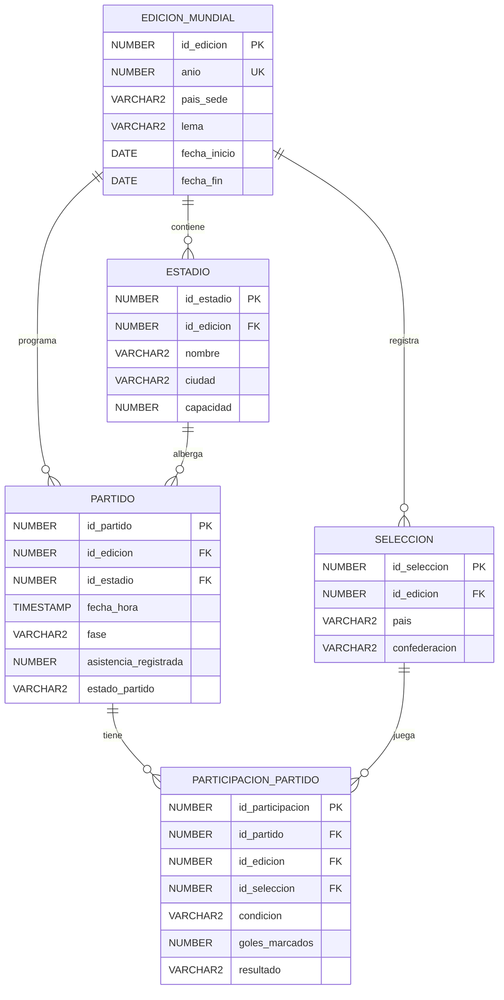
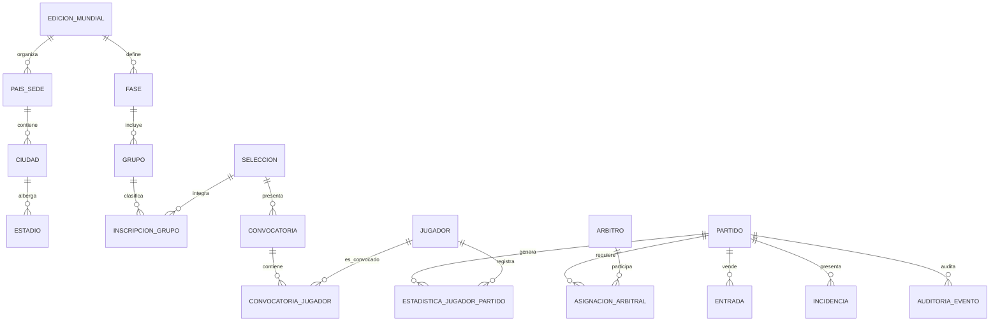

# Documento técnico — Entrega 1

## Sistema de Información para la Gestión Integral de la Copa Mundial de la FIFA

**Curso:** Bases de Datos  
**Motor:** Oracle Database  
**Cliente:** Oracle SQL Developer  
**Integrante:** Andrés Gómez  
**Entrega:** 1 — Modelo relacional, SQL e integridad sobre el modelo inicial

> **Nota de alcance básico (exigida por el curso):** esta versión solo usa los
> temas vistos en clase: Modelo Relacional, Introducción a SQL, JOINS,
> Agregación/Agrupamiento/Subconsultas, Vistas, Modificadores (INSERT/UPDATE/DELETE)
> e Integridad/Privilegios (PK, FK, UNIQUE, CHECK, GRANT/REVOKE).
> No usa PLSQL/Triggers, Transacciones-Concurrencia, MongoDB, ni PL/SQL
> (paquetes, triggers, DBMS_OUTPUT), ni funciones de ventana, ni WITH complejo.
> Las reglas que exigirían triggers se verifican con consultas del script
> `07_verificacion.sql`.

## 1. Descripción del problema y alcance

Una Copa Mundial genera información relacionada con sus ediciones, sedes, estadios,
selecciones y partidos. Para esta primera entrega se construye una base relacional que
permite registrar el calendario de un partido, asociarlo con un estadio y una edición,
relacionar exactamente dos selecciones con el encuentro y consultar el marcador resultante.

El alcance implementado corresponde al modelo genérico inicial de cinco entidades:

- `EDICION_MUNDIAL`: identifica una edición, su sede declarada, lema y fechas.
- `ESTADIO`: registra los escenarios disponibles para una edición.
- `SELECCION`: registra las selecciones participantes y su confederación.
- `PARTIDO`: registra fase, fecha, estadio, asistencia y estado del encuentro.
- `PARTICIPACION_PARTIDO`: resuelve la relación muchos-a-muchos entre partidos y
  selecciones, indicando condición y goles.

El sistema de esta entrega soporta:

1. Integridad referencial entre edición, estadio, selección y partido.
2. Validación del rango de fechas y de la agenda de los estadios.
3. Control de una selección local y una visitante por partido.
4. Coherencia entre goles y resultado de cada participación.
5. Carga de datos sintéticos, vistas analíticas y quince consultas SQL.
6. Pruebas de operaciones DML inválidas y de comportamientos de borrado.
7. Separación básica de permisos de consulta y operación.

No se implementan todavía jugadores, convocatorias, cuerpo técnico, arbitraje,
estadísticas detalladas, grupos, boletería, medios, incidencias ni auditoría. Estos
componentes se anticipan en la evaluación crítica y se desarrollarán después de recibir
retroalimentación sobre esta entrega.

### Interpretación del alcance

El enunciado presenta un mínimo general de 12–16 tablas para el proyecto completo, pero
indica expresamente que la Entrega 1 debe desarrollarse únicamente sobre el modelo
genérico inicial de cinco entidades. Por ello, esta versión implementa las cinco tablas y
deja la ampliación para las entregas 2 y 3. La tabla `PARTIDO` y la tabla
`PARTICIPACION_PARTIDO` reciben ajustes menores, documentados a continuación, para poder
cumplir las consultas y reglas de integridad exigidas en la Entrega 1.

## 2. Supuestos de modelado

1. **Identificadores:** las claves primarias son numéricas y no se reutilizan. En el
   dataset se cargan explícitamente para que las relaciones puedan auditarse fácilmente.
2. **Edición:** `anio` identifica de forma única una edición en el alcance de esta
   entrega. `pais_sede` conserva el atributo textual del modelo inicial; la separación de
   varios países anfitriones se propone como mejora futura.
3. **Fechas:** `fecha_inicio` y `fecha_fin` delimitan el periodo operativo de una edición.
   Un partido debe ocurrir entre el inicio y el final inclusive.
4. **Estadio:** un estadio pertenece a una sola edición en esta versión. La clave
   compuesta `(id_estadio, id_edicion)` se utiliza para evitar que un partido mezcle un
   estadio de otra edición.
5. **Selección:** una selección se registra como participante de una edición concreta.
   La misma denominación puede reaparecer en otra edición como un registro diferente.
6. **Partido:** cada partido tiene un único estadio, fecha/hora, fase y estado. Se evita
   la doble reserva de un estadio mediante una restricción `UNIQUE`.
7. **Participación:** cada partido cerrado tiene exactamente dos participaciones: una
   `LOCAL` y una `VISITANTE`. La unicidad de selección y condición evita duplicados.
8. **Marcador:** `goles_marcados` nunca es negativo. `resultado` se valida contra los
   goles de la otra participación del mismo partido.
9. **Estado transitorio:** un partido se puede crear como `PROGRAMADO` antes de cargar sus
   participaciones. Solo se puede pasar a `FINALIZADO` cuando tiene exactamente dos
   participaciones coherentes.
10. **Asistencia:** se registra por partido, aunque el modelo inicial no la incluía,
    porque la consulta de ocupación la exige. El trigger compara la asistencia con la
    capacidad del estadio.
11. **Datos:** todos los nombres de personas o resultados son ficticios. No se almacenan
    datos personales sensibles reales.
12. **Calendario sintético:** las fechas se generan en orden de fase para que la evolución
    deportiva sea cronológicamente legible. Las selecciones sintéticas 01 y 02 se
    conservan como casos de prueba que solo aparecen como visitantes.
13. **Oracle:** Oracle no soporta `ON UPDATE CASCADE` en claves foráneas. Las relaciones
    usan `ON DELETE CASCADE` únicamente donde la existencia del hijo depende totalmente
    del partido; en las demás se conserva el comportamiento `NO ACTION` implícito. Las
    claves no se actualizan como parte de la operación normal.

## 3. Modelo entidad–relación

El siguiente ERD representa el modelo implementado. La cardinalidad de
`PARTICIPACION_PARTIDO` se lee como una relación de uno a muchos durante la carga, con la
regla adicional de exactamente dos filas al cerrar el partido.


```mermaid
erDiagram
    EDICION_MUNDIAL ||--o{ ESTADIO : contiene
    EDICION_MUNDIAL ||--o{ SELECCION : registra
    EDICION_MUNDIAL ||--o{ PARTIDO : programa
    ESTADIO ||--o{ PARTIDO : alberga
    PARTIDO ||--o{ PARTICIPACION_PARTIDO : tiene
    SELECCION ||--o{ PARTICIPACION_PARTIDO : juega

    EDICION_MUNDIAL {
        NUMBER id_edicion PK
        NUMBER anio UK
        VARCHAR2 pais_sede
        VARCHAR2 lema
        DATE fecha_inicio
        DATE fecha_fin
    }

    ESTADIO {
        NUMBER id_estadio PK
        NUMBER id_edicion FK
        VARCHAR2 nombre
        VARCHAR2 ciudad
        NUMBER capacidad
    }

    SELECCION {
        NUMBER id_seleccion PK
        NUMBER id_edicion FK
        VARCHAR2 pais
        VARCHAR2 confederacion
    }

    PARTIDO {
        NUMBER id_partido PK
        NUMBER id_edicion FK
        NUMBER id_estadio FK
        TIMESTAMP fecha_hora
        VARCHAR2 fase
        NUMBER asistencia_registrada
        VARCHAR2 estado_partido
    }

    PARTICIPACION_PARTIDO {
        NUMBER id_participacion PK
        NUMBER id_partido FK
        NUMBER id_edicion FK
        NUMBER id_seleccion FK
        VARCHAR2 condicion
        NUMBER goles_marcados
        VARCHAR2 resultado
    }
```

## 4. Transformación al modelo lógico relacional

### 4.1 Relaciones resultantes

```text
EDICION_MUNDIAL(
  id_edicion PK,
  anio UK,
  pais_sede,
  lema,
  fecha_inicio,
  fecha_fin
)

ESTADIO(
  id_estadio PK,
  id_edicion FK -> EDICION_MUNDIAL.id_edicion,
  nombre,
  ciudad,
  capacidad,
  UK(id_edicion, nombre)
)

SELECCION(
  id_seleccion PK,
  id_edicion FK -> EDICION_MUNDIAL.id_edicion,
  pais,
  confederacion,
  UK(id_edicion, pais)
)

PARTIDO(
  id_partido PK,
  id_edicion FK -> EDICION_MUNDIAL.id_edicion,
  id_estadio,
  fecha_hora,
  fase,
  asistencia_registrada,
  estado_partido,
  FK(id_estadio, id_edicion) -> ESTADIO(id_estadio, id_edicion),
  UK(id_estadio, fecha_hora)
)

PARTICIPACION_PARTIDO(
  id_participacion PK,
  id_partido,
  id_edicion,
  id_seleccion,
  condicion,
  goles_marcados,
  resultado,
  FK(id_partido, id_edicion) -> PARTIDO(id_partido, id_edicion),
  FK(id_seleccion, id_edicion) -> SELECCION(id_seleccion, id_edicion),
  UK(id_partido, id_seleccion),
  UK(id_partido, condicion)
)
```

### 4.2 Justificación de llaves y cardinalidades

- `EDICION_MUNDIAL` es la entidad raíz del dominio. Su PK permite que una edición
  tenga múltiples estadios, selecciones y partidos.
- `ESTADIO.id_edicion` y `SELECCION.id_edicion` son FKs obligatorias: no existe un
  estadio ni una selección en el sistema sin una edición asociada.
- `PARTIDO.id_edicion` permite consultar y validar el calendario de una edición. La FK
  compuesta contra `ESTADIO` asegura que el estadio pertenece a esa misma edición.
- `PARTICIPACION_PARTIDO` es la entidad asociativa de la relación N:M entre partidos y
  selecciones. Una selección participa en muchos partidos y un partido tiene dos
  selecciones.
- `UK(id_partido, id_seleccion)` impide que una selección aparezca dos veces en el mismo
  encuentro.
- `UK(id_partido, condicion)` impide dos locales o dos visitantes.
- La cantidad máxima de dos participaciones se controla con un trigger de sentencia. La
  cantidad exacta se valida al cambiar el partido a `FINALIZADO`.
- Las claves compuestas no duplican la identidad del registro; refuerzan la consistencia
  entre entidades que comparten la edición.

### 4.3 Decisiones de borrado y actualización

| Relación | Borrado | Actualización | Justificación |
|---|---|---|---|
| Edición → Estadio | `NO ACTION` implícito | No disponible en Oracle | No se puede borrar una edición con estadios dependientes. |
| Edición → Selección | `NO ACTION` implícito | No disponible en Oracle | Conserva el historial de participantes. |
| Edición → Partido | `NO ACTION` implícito | No disponible en Oracle | Impide eliminar el calendario accidentalmente. |
| Estadio → Partido | `NO ACTION` implícito | No disponible en Oracle | Evita dejar partidos sin sede. |
| Partido → Participación | `CASCADE` | No disponible en Oracle | Una participación no tiene sentido sin su partido; al borrar el partido se limpian sus dos filas. |
| Selección → Participación | `NO ACTION` implícito | No disponible en Oracle | Una selección con partidos no puede eliminarse y perder el historial. |

En Oracle el comportamiento `NO ACTION` es el comportamiento por defecto cuando no se
especifica `ON DELETE CASCADE`; la operación se rechaza si existen filas hijas. Oracle no
permite escribir `ON UPDATE CASCADE` en una FK, por lo que no se incluye una sintaxis
incompatible. La prueba DML documenta ambas decisiones.

## 5. Diccionario de datos

### 5.1 `EDICION_MUNDIAL`

| Atributo | Tipo | Nulo | Restricciones | Descripción |
|---|---|---|---|---|
| `id_edicion` | `NUMBER(4)` | No | PK | Identificador interno de la edición. |
| `anio` | `NUMBER(4)` | No | `UNIQUE`, `CHECK` entre 1930 y 2200 | Año de la edición. |
| `pais_sede` | `VARCHAR2(120)` | No | — | País o conjunto de países sede en el alcance inicial. |
| `lema` | `VARCHAR2(200)` | No | — | Lema o nombre descriptivo de la edición. |
| `fecha_inicio` | `DATE` | No | Junto con `fecha_fin` | Inicio del periodo del torneo. |
| `fecha_fin` | `DATE` | No | Mayor que `fecha_inicio` | Fin del periodo del torneo. |

### 5.2 `ESTADIO`

| Atributo | Tipo | Nulo | Restricciones | Descripción |
|---|---|---|---|---|
| `id_estadio` | `NUMBER(10)` | No | PK | Identificador del estadio. |
| `id_edicion` | `NUMBER(4)` | No | FK a `EDICION_MUNDIAL` | Edición a la que se asigna el estadio. |
| `nombre` | `VARCHAR2(120)` | No | Único por edición | Nombre del estadio. |
| `ciudad` | `VARCHAR2(80)` | No | — | Ciudad sede. |
| `capacidad` | `NUMBER(6)` | No | `CHECK` entre 10.000 y 120.000 | Aforo máximo del estadio. |

### 5.3 `SELECCION`

| Atributo | Tipo | Nulo | Restricciones | Descripción |
|---|---|---|---|---|
| `id_seleccion` | `NUMBER(10)` | No | PK | Identificador de la selección dentro del esquema. |
| `id_edicion` | `NUMBER(4)` | No | FK a `EDICION_MUNDIAL` | Edición en la que participa. |
| `pais` | `VARCHAR2(100)` | No | Único por edición | Nombre de la selección; en el dataset es sintético. |
| `confederacion` | `VARCHAR2(20)` | No | `CHECK` de confederaciones FIFA | Confederación continental declarada. |

### 5.4 `PARTIDO`

| Atributo | Tipo | Nulo | Restricciones | Descripción |
|---|---|---|---|---|
| `id_partido` | `NUMBER(10)` | No | PK | Identificador del encuentro. |
| `id_edicion` | `NUMBER(4)` | No | FK a `EDICION_MUNDIAL` | Edición del encuentro. |
| `id_estadio` | `NUMBER(10)` | No | FK compuesta con `id_edicion` | Estadio donde se juega. |
| `fecha_hora` | `TIMESTAMP` | No | Única por estadio; dentro de la edición | Fecha y hora programadas. |
| `fase` | `VARCHAR2(30)` | No | `CHECK` de fases permitidas | Fase o instancia del torneo. |
| `asistencia_registrada` | `NUMBER(6)` | No | No negativa y menor o igual a capacidad | Público registrado para el encuentro. |
| `estado_partido` | `VARCHAR2(15)` | No | `CHECK`: programado, en juego, finalizado o cancelado | Estado operativo del partido. |

### 5.5 `PARTICIPACION_PARTIDO`

| Atributo | Tipo | Nulo | Restricciones | Descripción |
|---|---|---|---|---|
| `id_participacion` | `NUMBER(12)` | No | PK | Identificador de la participación. |
| `id_partido` | `NUMBER(10)` | No | FK compuesta; `ON DELETE CASCADE` | Encuentro al que pertenece. |
| `id_edicion` | `NUMBER(4)` | No | Parte de las FKs compuestas | Edición redundante para reforzar coherencia. |
| `id_seleccion` | `NUMBER(10)` | No | FK compuesta | Selección que participa. |
| `condicion` | `VARCHAR2(10)` | No | `CHECK`: `LOCAL` o `VISITANTE`; única por partido | Rol de la selección en el encuentro. |
| `goles_marcados` | `NUMBER(3)` | No | `CHECK` entre 0 y 99 | Goles anotados por la selección. |
| `resultado` | `VARCHAR2(7)` | No | `CHECK`: `GANO`, `EMPATO` o `PERDIO` | Resultado de la selección frente al marcador rival. |

## 6. Implementación DDL y restricciones de negocio (solo conceptos básicos)

El archivo `sql/01_ddl.sql` implementa únicamente integridad declarativa básica:

- Las cinco tablas y sus PK.
- FK simples (`id_edicion`, `id_estadio`, `id_partido`, `id_seleccion`), incluyendo
  `ON DELETE CASCADE` solo de `PARTIDO` a `PARTICIPACION_PARTIDO`.
- `UNIQUE` para años, nombres de estadio por edición, selecciones por edición, agenda
  del estadio, selección por partido y condición por partido.
- `CHECK` para rangos, estados, fases, confederaciones, condiciones, goles y resultados.
- `DEFAULT` para asistencia (`0`) y estado (`PROGRAMADO`).
- Tipo `DATE` para fechas (más básico que `TIMESTAMP`).
- 2 índices simples de consulta frecuente (`partido(id_edicion,fase)` y
  `participacion(id_seleccion)`).

No hay paquetes, ni triggers, ni PL/SQL, porque son temas no vistos.
La combinación de `CHECK (condicion IN ('LOCAL','VISITANTE'))` y
`UNIQUE(id_partido, condicion)` limita cada partido a un local y un visitante
sin necesidad de triggers.

### 6.1 Restricciones y cómo se verifican sin triggers

| Regla | Implementación básica | Verificación |
|---|---|---|
| No hay goles negativos | `CHECK` en `goles_marcados` | Consulta “goles < 0” en `07_verificacion.sql` (0 filas) |
| Un partido tiene un local y un visitante | `UNIQUE(id_partido, condicion)` | Consulta de condición duplicada (0 filas) |
| No hay tercera selección ni repetidos | `UNIQUE(id_partido,id_seleccion)` | Consulta de duplicados, Q14 (0 filas) |
| Un estadio no tiene horarios cruzados | `UNIQUE(id_estadio, fecha_hora)` | El DDL lo rechaza al insertar |
| Asistencia no negativa | `CHECK (asistencia >= 0)` | Carga correcta + consulta vs capacidad |
| Asistencia no supera aforo | Dato cargado correcto (sin trigger) | Consulta `asistencia > capacidad` (0 filas) |
| Partido dentro de la edición | Dato cargado correcto (sin trigger) | Consulta de fechas fuera de rango (0 filas) |
| Resultado coherente con goles | Dato cargado correcto (sin trigger) | Revisión manual del dataset pequeño |
| Exactamente 2 participaciones | Dato cargado correcto (sin trigger) | Consulta `COUNT <> 2` (0 filas) |
| No se elimina selección con historial | FK con `NO ACTION` implícito | `DELETE` de prueba debe dar ORA-02292 |

Las reglas de convocatorias, edad, dorsales, jugadores, árbitros y estadísticas
individuales se declaran fuera de alcance porque esas entidades no existen en el modelo
inicial. Se incorporan como trabajo de la Entrega 2.

## 7. Datos de prueba (solo INSERT básicos)

El archivo `sql/02_datos_prueba.sql` carga un dataset sintético pequeño solo con
`INSERT INTO ... VALUES` (tema Modificadores), sin PL/SQL ni bucles:

- 2 ediciones (`2026` y `2030`).
- 5 estadios (3 en 2026, 2 en 2030).
- 10 selecciones (6 en 2026, 4 en 2030).
- 8 partidos (6 en 2026, 2 en 2030).
- 16 participaciones, exactamente dos por partido (`LOCAL` + `VISITANTE`).

Casos incluidos a propósito: un 0–0 (5002), un 4–4 con 8 goles (5003),
dos selecciones que en 2026 solo juegan como visitantes (Senegal y
Nueva Zelanda, para la consulta 10) y estadios con más de una fase
(Azteca y Bogotá, para la consulta 13).

La tabla de ediciones es un catálogo pequeño y por naturaleza no requiere 100 filas. Las
demás tablas de operación superan el mínimo de 100 registros solicitado. Todos los
encuentros tienen fechas dentro de su edición, siguen el orden de sus fases, usan un
estadio de la misma edición y tienen dos selecciones distintas. Las selecciones
sintéticas 01 y 02 permiten obtener resultados para el caso “todos los partidos como
visitante” de la consulta 10.

## 8. Vistas

Se implementan cinco vistas en `sql/03_vistas.sql`:

1. **`VW_MARCADOR_PARTIDOS`**: muestra partido, fase, sede, local, visitante y marcador
   en una sola fila. Simplifica el calendario y se reutiliza en consultas de partidos
   atípicos y máximos marcadores; las consultas analíticas filtran partidos finalizados.
2. **`VW_TABLA_POSICIONES`**: calcula partidos, victorias, empates, derrotas, puntos,
   goles a favor, goles en contra y diferencia por edición y selección, únicamente a
   partir de partidos finalizados. Solo usa `JOIN` + `GROUP BY` (sin `WITH` ni ventanas).
3. **`VW_GOLEADORES_SEL`**: consolida goles y partidos por selección y edición usando
   partidos finalizados. Sirve para rankings sobre el modelo inicial.
4. **`VW_OCUPACION_ESTADIO`**: calcula asistencia total, partidos albergados y ocupación
   promedio estimada por estadio.
5. **`VW_PARTIDOS_ATIPICOS`**: reutiliza el marcador para identificar partidos 0–0 o
   con ocho o más goles combinados. El umbral de ocho se declara como supuesto analítico.

Las vistas reducen lógica repetida, facilitan el acceso de consulta y permiten restringir
la exposición a columnas operativas innecesarias.

## 9. Modificadores DML y pruebas (solo INSERT/UPDATE/DELETE/SELECT)

El archivo `sql/04_dml_pruebas.sql` usa únicamente modificadores básicos:

1. Crea un partido de prueba (990000) en estado `PROGRAMADO` con `INSERT`.
2. Inserta sus dos participaciones con dos `INSERT` simples.
3. Actualiza el marcador con `UPDATE`.
4. Cierra el encuentro a `FINALIZADO` con `UPDATE`.
5. Cada caso inválido está comentado para descomentar y ver el error Oracle
   (`CHECK`, `UNIQUE` o FK): gol negativo, tercera participación, selección
   repetida, asistencia negativa, fase inválida y selección inexistente.
6. Borra el partido de prueba con `DELETE` y verifica con `SELECT COUNT(*)`
   que sus participaciones se borraron por `ON DELETE CASCADE`.
7. Intenta eliminar la selección 101 con historial (comentado): debe fallar
   con ORA-02292 por `NO ACTION` implícito.

## 10. Privilegios básicos (solo GRANT/REVOKE)

El archivo `sql/05_privilegios.sql` solo usa `CREATE ROLE`, `GRANT` y `REVOKE`:

- `ROL_FIFA_E1_ANDRES_CONSULTA`: `SELECT` sobre las cinco tablas y las cinco vistas; no recibe
  permisos de modificación.
- `ROL_FIFA_E1_ANDRES_OPERATIVO`: `SELECT` sobre el modelo y `INSERT`/`UPDATE` sobre `PARTIDO` y
  `PARTICIPACION_PARTIDO`; se le revoca `DELETE` explícitamente.

El esquema inicial todavía no tiene auditoría. El control de auditoría se incorporará en
la ampliación del modelo. La prueba de acceso se debe completar otorgando los roles a
usuarios de prueba del servidor del curso y ejecutando una consulta permitida y una
operación denegada por cada rol.

## 11. Álgebra relacional

Las traducciones de cuatro consultas SQL se encuentran en
[`algebra_relacional.md`](algebra_relacional.md). Se utilizan selección `σ`, proyección
`π`, renombre `ρ`, junta `⋈`, agregación `γ`, diferencia `−` y ordenamiento extendido para
expresar rankings.

## 12. Evaluación crítica del modelo inicial

Esta sección es analítica y no modifica el DDL de la Entrega 1.

### 12.1 Problemas identificados y ajustes propuestos

| Problema del modelo inicial | Consecuencia | Ajuste propuesto para la ampliación | Beneficio |
|---|---|---|---|
| `pais_sede` es texto libre | No representa varios países y duplica información | Crear `PAIS_SEDE` y una relación entre edición y país sede | Normaliza anfitriones y permite agregaciones confiables. |
| `ciudad` está dentro de `ESTADIO` | Se repite el nombre de ciudad en varios estadios | Crear `CIUDAD` relacionada con sede | Evita inconsistencias de escritura. |
| `fase` es texto libre en `PARTIDO` | Puede haber valores incompatibles | Crear catálogo `FASE` y, si aplica, `LLAVE_ELIMINATORIA` | Controla fases y cruces. |
| No existe `GRUPO` | No se puede derivar tabla de posiciones por grupo | Crear `GRUPO` y `INSCRIPCION_GRUPO` por edición | Modela fase de grupos y clasificación. |
| No se modelan jugadores | No se pueden registrar convocatorias o rendimiento | Crear `JUGADOR`, `CONVOCATORIA` y `CONVOCATORIA_JUGADOR` | Permite historial por edición, dorsal y selección. |
| No se modela el cuerpo técnico | Falta información de responsables deportivos | Crear `CUERPO_TECNICO` y asignaciones | Representa entrenadores y asistentes. |
| No se modela arbitraje | No se conoce quién dirigió un partido | Crear `ARBITRO`, `ROL_ARBITRAL` y `ASIGNACION_ARBITRAL` | Resuelve la relación N:M con roles. |
| No hay eventos individuales | El marcador no puede auditarse por jugador | Crear `EVENTO_PARTIDO` y/o `ESTADISTICA_JUGADOR_PARTIDO` | Permite goles, asistencias, tarjetas y minutos. |
| No hay boletería ni público detallado | La asistencia no se puede explicar por entradas | Crear `ENTRADA`, `ZONA_ESTADIO` y control de acceso | Soporta ventas y ocupación real. |
| No hay medios ni acreditaciones | No se controla acceso de prensa | Crear `MEDIO`, `PERIODISTA` y `ACREDITACION` | Separa información pública y operativa. |
| No hay incidencias | No se registran suspensiones o eventos VAR | Crear `TIPO_INCIDENCIA` e `INCIDENCIA` | Permite análisis operativo por fase y sede. |
| No hay auditoría | No existe trazabilidad de cambios | Crear `AUDITORIA_EVENTO` y triggers | Registra actor, fecha y modificación. |

### 12.2 Boceto conceptual del modelo ampliado


```mermaid
erDiagram
    EDICION_MUNDIAL ||--o{ PAIS_SEDE : organiza
    PAIS_SEDE ||--o{ CIUDAD : contiene
    CIUDAD ||--o{ ESTADIO : alberga
    EDICION_MUNDIAL ||--o{ FASE : define
    FASE ||--o{ GRUPO : incluye
    GRUPO ||--o{ INSCRIPCION_GRUPO : clasifica
    SELECCION ||--o{ INSCRIPCION_GRUPO : integra
    SELECCION ||--o{ CONVOCATORIA : presenta
    CONVOCATORIA ||--o{ CONVOCATORIA_JUGADOR : contiene
    JUGADOR ||--o{ CONVOCATORIA_JUGADOR : es_convocado
    PARTIDO ||--o{ ASIGNACION_ARBITRAL : requiere
    ARBITRO ||--o{ ASIGNACION_ARBITRAL : participa
    PARTIDO ||--o{ ESTADISTICA_JUGADOR_PARTIDO : genera
    JUGADOR ||--o{ ESTADISTICA_JUGADOR_PARTIDO : registra
    PARTIDO ||--o{ ENTRADA : vende
    PARTIDO ||--o{ INCIDENCIA : presenta
    PARTIDO ||--o{ AUDITORIA_EVENTO : audita
```

### 12.3 Entidades anticipadas

`PAIS_SEDE`, `CIUDAD`, `FASE`, `GRUPO`, `LLAVE_ELIMINATORIA`,
`INSCRIPCION_GRUPO`, `FEDERACION_NACIONAL`, `JUGADOR`, `CONVOCATORIA`,
`CONVOCATORIA_JUGADOR`, `CUERPO_TECNICO`, `ARBITRO`, `ROL_ARBITRAL`,
`ASIGNACION_ARBITRAL`, `EVENTO_PARTIDO`, `ESTADISTICA_JUGADOR_PARTIDO`,
`SUSTITUCION`, `ZONA_ESTADIO`, `ENTRADA`, `MEDIO`, `PERIODISTA`,
`ACREDITACION`, `TIPO_INCIDENCIA`, `INCIDENCIA` y `AUDITORIA_EVENTO`.

## 13. Evidencias de ejecución en el servidor (solo SELECT)

Antes de entregar, ejecutar en orden `01` a `07` y guardar:
- Conteo de filas por tabla (esperado 2 / 5 / 10 / 8 / 16).
- Resultados de las quince consultas básicas.
- SELECT de cada paso del DML y conteo post-`DELETE` en cascada.
- Errores al descomentar cada caso inválido (`CHECK`/`UNIQUE`/FK).
- Evidencia de `GRANT` con `user_tab_privs_made`.
- Salidas de `07_verificacion.sql` (todas las reglas con cero filas).

## 14. Implementación de la Entrega 3 (VERSIÓN BÁSICA, sin programación PL/SQL)

La tercera entrega conserva la base E1 y la amplía solo con DDL/DML básicos
(FK simples, `DATE`, IDs manuales, 2 índices). No hay funciones, paquete,
tipos, secuencias ni triggers (temas no vistos):

- `SEDE`, `EDICION_SEDE`, `CIUDAD` y `GRUPO_TORNEO`;
- `INSCRIPCION_GRUPO`, `JUGADOR`, `CONVOCATORIA` y `CONVOCATORIA_JUGADOR`;
- `CUERPO_TECNICO` y `ASIGNACION_CUERPO_TECNICO`;
- `ESTADISTICA_JUGADOR_PARTIDO`, `TIPO_INCIDENCIA` e `INCIDENCIA`;
- `TABLA_POSICIONES_E3`, `CIERRE_FASE` y `AUDITORIA_EVENTO` (manual).

### 14.1 Operaciones equivalentes sin PL/SQL

`sql/10_entrega3_programacion.sql` reemplaza cada programa por SQL básico:

1. Diferencia de gol: `SUM` con `CASE`.
2. Resultado esperado: `CASE` (ej. 2-1 → `GANO/PERDIO`).
3. Partido válido: `COUNT` de `LOCAL/VISITANTE` + consulta de inconsistencias (0 filas).
4. Goles de jugador: `SUM` filtrado.
5. Ranking: `GROUP BY + ORDER BY + FETCH FIRST` (sin función pipelined).
6. Puntos: `SUM(CASE resultado...)`.
7. Carga de resultado: `UPDATE` doble comentado como práctica.
8. Posiciones: `DELETE + INSERT SELECT` (10 filas).
9. Cierre de fase: `INSERT` en `CIERRE_FASE` + verificación.
10. Auditoría: `INSERT` manual (sin triggers).

### 14.2 Reportes y aplicación (básicos)

`sql/11_entrega3_reportes.sql` expone 6 vistas sin ventanas ni PL/SQL
(resultados, posiciones por grupo, goleadores, incidencias, resumen por fase
y auditoría). La tabla de posiciones ya viene llena desde el script 10 con
`INSERT SELECT`. La aplicación en `app/` replica esos casos con `localStorage`
(CRUD, partidos, estadísticas, filtros por edición/selección/grupo/fase) sin
llamar a funciones ni paquetes Oracle.

### 14.3 Evidencia de ejecución (solo SELECT)

`sql/12_entrega3_pruebas.sql` muestra diferencia/puntos con `SELECT`, ranking
`top 5`, `UPDATE` de ejemplo, cierre y conteo de los 6 reportes (sin funciones
ni triggers). `sql/13_entrega3_verificacion.sql` comprueba conteos, grupos de
máximo 4, coherencia marcador vs estadísticas, partidos completos e
incidencias auditadas, todo con `SELECT` (cero filas en las reglas).
